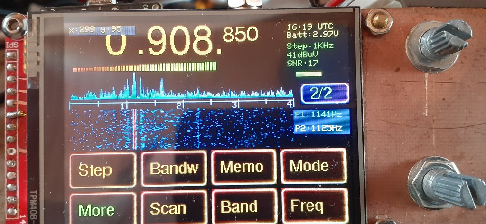

# SI4732-receiver
This firware is for receivers that use a SI473x chip together with an ESP32 MCU and an ILI9341 display. It contains a ported version with many (but not all) features of my wide band receiver project. 
The firmware will run on diy receivers that follow the "common" wiring scheme that has been published several times.
It will also rone on some (mostly older) versions of the ATS25.
An audio signal of 1-2Vpp on GIO32 is needed for waterfall, Web Interface and the decoder modules. CW, RTTY, SSTV and WEFAX decoders are included.
A web interface that allows remote control and listening is included.
Please note that this firmware is free for personal use, but not commercial use. 

