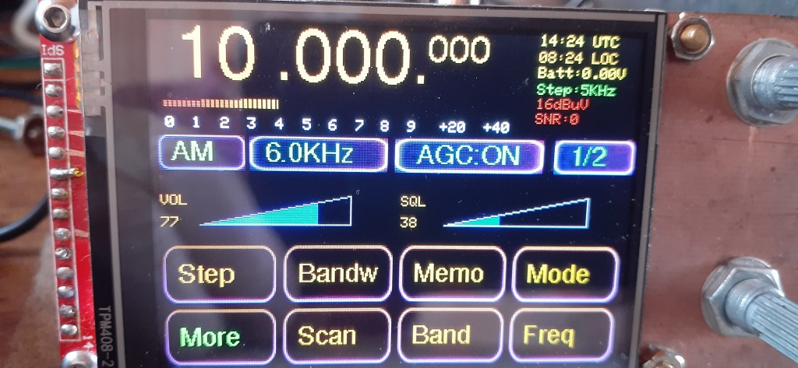

# SI4732-receiver
This firware is for receivers that use a SI473x chip together with an ESP32 MCU and an ILI9341 display. It contains a ported version with many (but not all) features of my wide band receiver project. 
The firmware will run on diy receivers that follow the "common" wiring scheme that has been published several times. It will also run on some versions of the ATS25 receiver. 
CW, RTTY, SSTV and WEFAX decoders are included.
A web interface is included.
Please note that this firmware is free for personal use, but not commercial use. 

